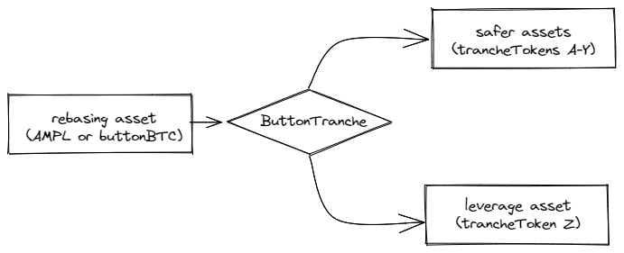

# Tranche

Tranche is a protocol for _stratifying price risk_ of crypto-assets. At the core, it allows users to deposit an asset in return for several `Tranche` assets, each representing a different risk level. The safer assets have relatively stable value, while the risky assets have value roughly equivalent to a leveraged position of the underlying asset.&#x20;

The following sections will explain how this mechanism works and why it's useful.&#x20;
