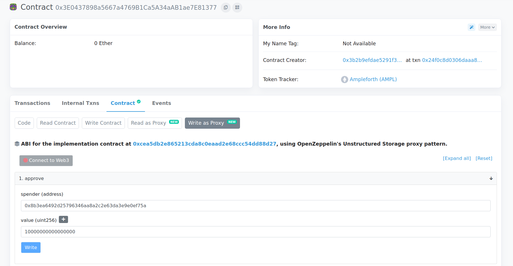
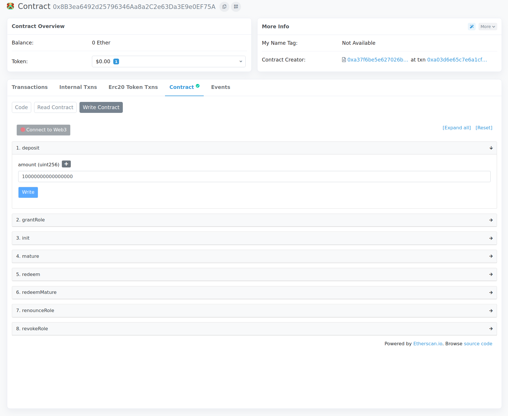
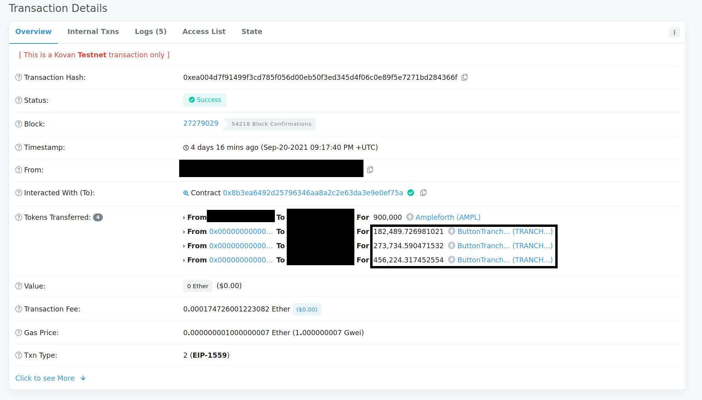

# Market Making

Currently there is no UI interface for market making. However, it is possible via a couple manual steps.

## Deposit Collateral

The first step of the process is to deposit collateral for TRANCHE tokens. To do this, you will need to identify the address of the _bond_ instance that you want to lend to. In this example, we will use the testnet instance located [here](https://kovan.etherscan.io/address/0x8b3ea6492d25796346aa8a2c2e63da3e9e0ef75a) \(0x8b3ea6492d25796346aa8a2c2e63da3e9e0ef75a\).

#### Approve

Firstly, you need to `approve` your collateral to the Bond contract. In our case we are using AMPL as collateral, so we will go to the AMPL etherscan page. Under `write contract`, connect your wallet and click `approve`. Enter the bond address as the `spender`, and the amount of collateral you want to deposit as the `amount.`

Then click `write` to finish approving the collateral. 

#### Deposit

Make your way to the `write contract` section of the bond contract. Connect your wallet and enter the amount of collateral you want to deposit. 

After clicking `write`, and waiting for the transaction to confirm, you should end up with a bunch of TRANCHE Tokens

## Provide Liquidity on Uniswap

The main borrowing pools on Uniswap are TRANCHE-A / USDC and TRANCHE-B / USDC. In order to lend, you will need to supply liquidity to these pools. 

1. Acquire some USDC of equal value to your A and B tranche tokens
2. Go to app.uniswap.org, click "Pool"
3. Click "New Position"
4. Enter TRANCHE-A as the first token, and USDC as the second token
5. Enter the amount of liquidity you want to add, and finish going through the wizard flow
6. Repeat steps 3-5 for your TRANCHE-B tokens.

